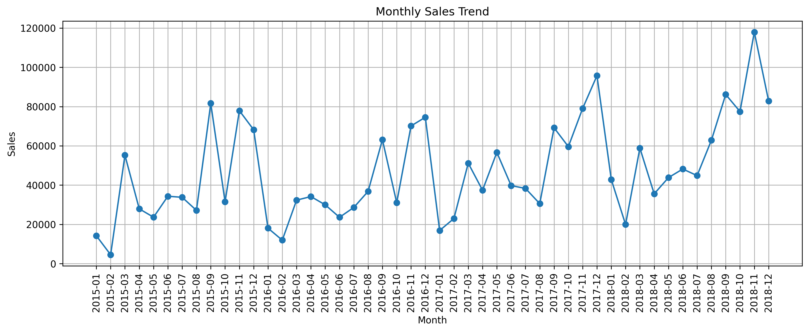
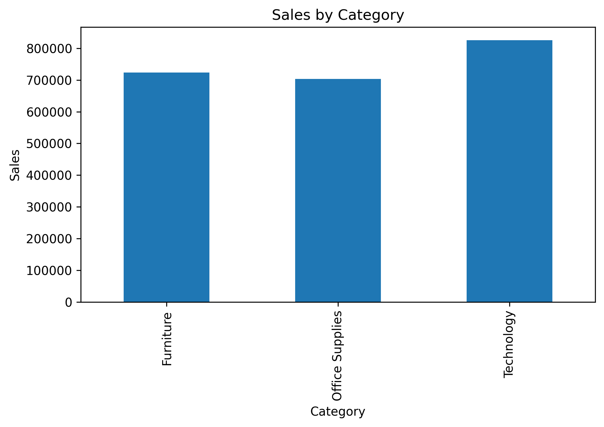
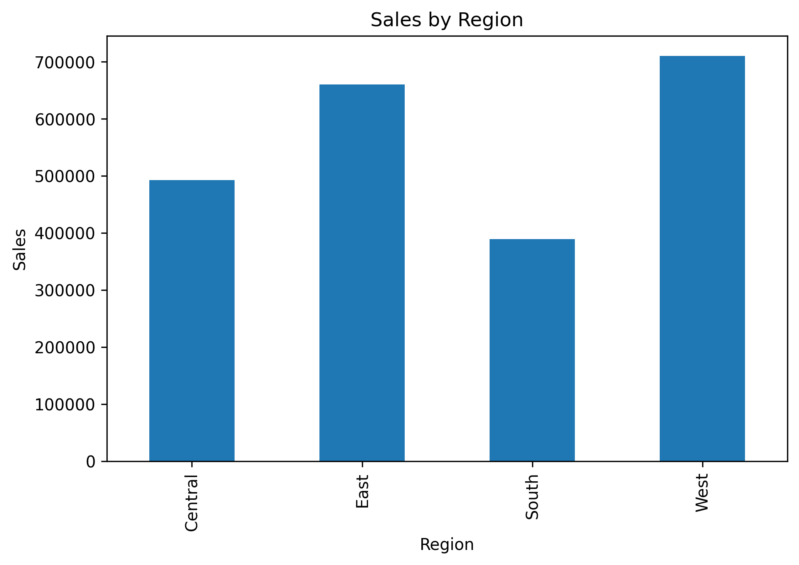
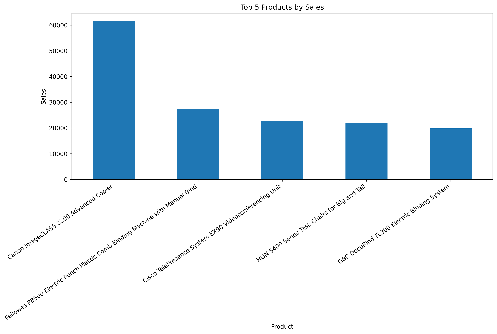
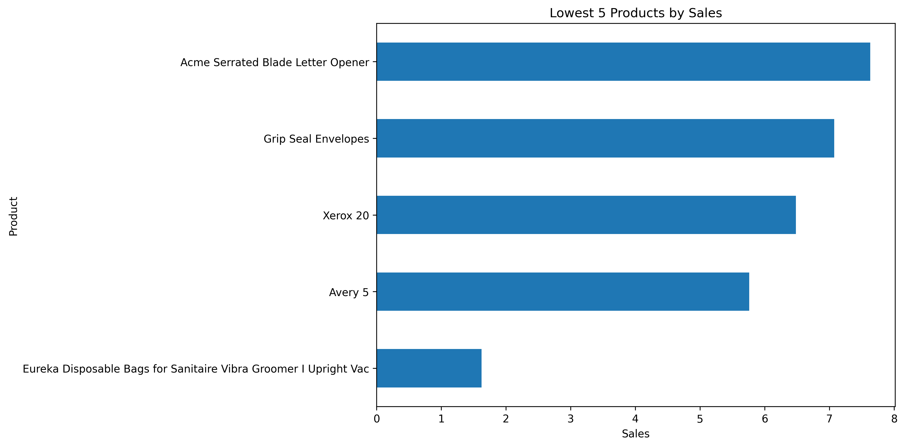
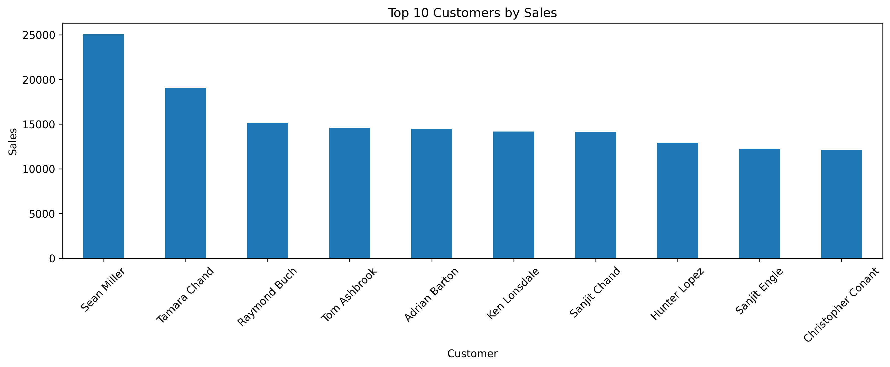
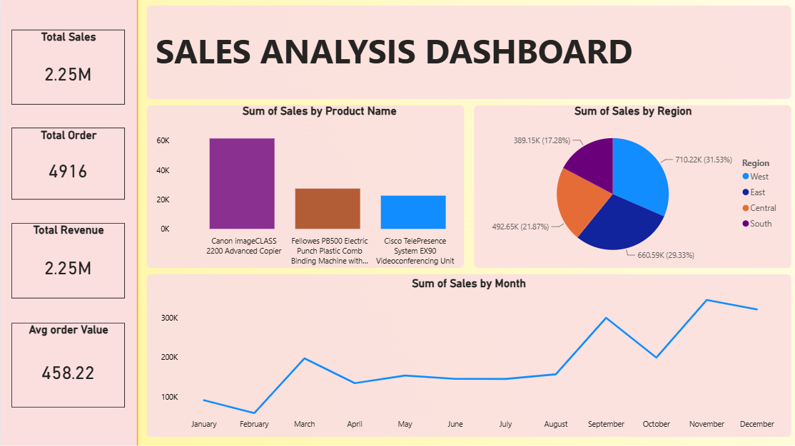

# 📊 Sales Performance Analytics

## Data Analytics Internship Project

This project was completed as part of the **inturn-edu Data Analytics Internship**. The objective is to analyze retail sales data, identify business trends, and build an interactive Power BI dashboard using Python and Power BI.

---

# 📌 Problem Statement

Analyze Superstore sales data to identify sales trends, top-performing products, regional performance, customer insights, and business opportunities using Python and Power BI.

---

# 🎯 Objectives

- Clean and preprocess the dataset
- Perform Exploratory Data Analysis (EDA)
- Analyze monthly sales trends
- Identify top and lowest performing products
- Analyze sales by category and region
- Identify top customers
- Develop an interactive Power BI Dashboard
- Generate business insights

---

# 📂 Dataset Information

## Source of Dataset

The project uses the **Superstore Sales Dataset**, a publicly available retail sales dataset commonly used for data analytics and business intelligence projects.

## Type of Data

The dataset contains:

- Order ID
- Order Date
- Ship Date
- Customer Name
- Segment
- Region
- Category
- Product Name
- Quantity
- Discount
- Sales

## Why this Dataset?

This dataset provides real-world retail sales information suitable for data cleaning, exploratory data analysis, visualization, and dashboard development.

---

# 🛠️ Technologies Used

- Python
- Jupyter Notebook
- Pandas
- NumPy
- Matplotlib
- Seaborn
- Power BI

---

# 📊 Exploratory Data Analysis

The following analyses were performed:

- Total Sales
- Total Orders
- Average Order Value
- Monthly Sales Trend
- Top 5 Products
- Lowest 5 Products
- Sales by Category
- Sales by Region
- Top 10 Customers

---

# 📷 EDA Visualizations

## Monthly Sales Trend

---

## Sales by Category

---

## Sales by Region

---

## Top 5 Products

---

## Lowest 5 Products

---

## Top 10 Customers

---

# 📈 Power BI Dashboard

---

# 💡 Business Insights

- Technology products generated the highest sales.
- The West region recorded the highest sales.
- Monthly sales showed seasonal fluctuations.
- A few customers contributed significantly to overall revenue.
- Low-performing products can be targeted with promotional campaigns.

---

# 📚 Conclusion

This project demonstrates the complete data analytics workflow—from data cleaning and exploratory data analysis to dashboard creation and business insight generation. The interactive Power BI dashboard enables users to monitor sales performance and support data-driven decision-making.

---

# 👨‍💻

**Hiren Kachiya**

Data Analytics Internship Project

GitHub: https://github.com/kachiyahiren
